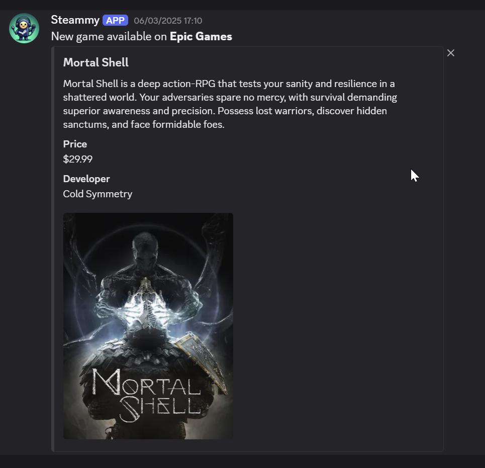

# Steammy

Steammy is a **Discord** bot designed to make announcements of new games arriving in well known platforms such as Microsoft Game Pass, Sony PS+ and Epic Games

## Currently Integrated platforms

- [x] Xbox Game Pass
- [ ] Sony PS+
- [X] Epic Games

## How to use

1. Invite Steammy to your server [here](https://discord.com/oauth2/authorize?client_id=1284565018788106273)
1. `/subscribe <PLATFORM>` on the channel you want to receive notifications
1. Done! Just wait for upcoming games

You can `/unsubscribe` to stop a channel from receiving news

## How to contribute

### Adding more platforms

1. Create a new catalog entity (`src/entities/CatalogMyPlatform.ts`). You can use the existing ones as reference
    - Implement a `fetchNotBroadcasted` method that retrieves all games that haven't been published to Discord yet
1. Run `npm run migration:create` to create a new migration file using MikroORM
1. Run `npm run migration:up` to run the newly created migration
1. Create a new service for the platform you want to add in `src/services/Platforms` folder
    - This service must implement a `sync` method that inserts new records to its respective catalog table
    - You can use `MAPPER_SCHEMA` to translate the API response to the catalog table, according to the Platform's API you're adding (use [Epic MAPPER_SCHEMA](src/services/Platforms/Epic.ts) as reference). Read [object-mapper](https://www.npmjs.com/package/object-mapper) docs
1. Add a schedule to [Broadcast](src/services/Broadcast.ts) to publish new games to Discord