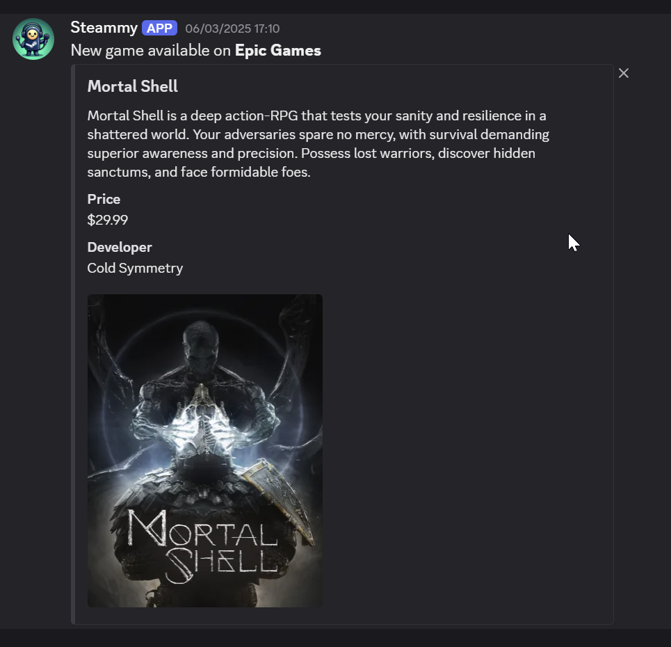

# Steammy

Steammy is a **Discord** bot built on **NestJS**, **[Necord](https://necord.org/)**, and **TypeORM**, designed to make announcements of new games arriving on popular platforms such as Microsoft Game Pass and Epic Games.



## Currently Integrated Platforms

- [x] Xbox Game Pass
- [ ] Sony PS+
- [x] Epic Games

## How to use

1. Invite Steammy to your server [here](https://discord.com/oauth2/authorize?client_id=1284565018788106273)
2. Run `/subscribe <platform>` in the channel where you want to receive announcements
3. Done! Just wait for upcoming game announcements

You can use `/unsubscribe <platform>` to stop a channel from receiving announcements.

### Available Commands
- `/subscribe <platform>` - Subscribe a channel to game news (`xbox`, `epic`)
- `/unsubscribe <platform>` - Unsubscribe a channel from game news
- `/ping` - Check bot latency
- `/invite` - Get bot invite link
- `/help` - View command help
- `/sync <platform>` - Manually sync catalog (Admin only)
- `/broadcast <platform>` - Manually trigger broadcast (Admin only)

## Development

Requires **Node.js >= 22.12** (see `.nvmrc`).

```bash
# Install dependencies
# --ignore-scripts works around a crash in necord's own postinstall on Windows.
npm install --ignore-scripts

# Start in watch mode
npm run start:dev

# Build for production (outputs to dist/)
npm run build

# Run the compiled build
npm run start:prod
```

### Scripts

| Script               | Description                            |
| -------------------- | -------------------------------------- |
| `npm run start:dev`  | Watch mode with `NODE_ENV=development`  |
| `npm run build`      | Compile TypeScript to `dist/`          |
| `npm run start:prod` | Run the compiled `dist/main.js`        |
| `npm run format`     | Format `src/` and `test/` with Prettier |
| `npm run lint`       | Lint and autofix with ESLint           |
| `npm run type:check` | Typecheck without emitting             |
| `npm test`           | Unit tests (Jest)                      |
| `npm run test:e2e`   | End-to-end tests (Jest + supertest)    |

## How to contribute: Adding more platforms

1. Create a new TypeORM catalog entity (`src/database/entities/catalog-myplatform.entity.ts`).
2. Register the entity in `src/database/database.module.ts` and `src/database/entities/index.ts`.
3. Create a platform service (`src/modules/platforms/myplatform.service.ts`) with a `@Cron()` schedule to sync games.
4. Register the new platform choice in `src/shared/constants.ts` and `src/modules/subscription/dto/platform-option.dto.ts`.
5. Add broadcasting logic in `src/modules/broadcast/broadcast.service.ts`.